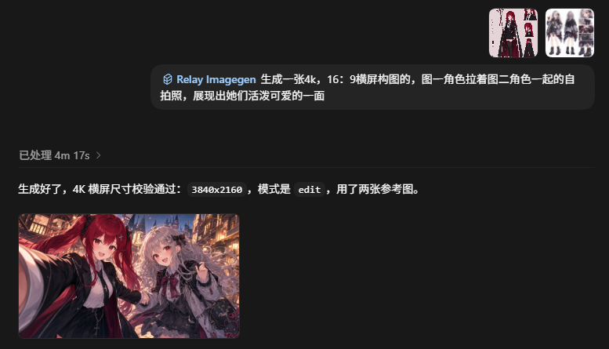

# Relay Imagegen

[中文说明](README.md)

Fixes the awkward parts of relay-based Codex image generation: unstable resolution, aspect ratio, prompt records, and output records.

Using a relay and still frustrated that Codex's in-chat image generation does not follow the aspect ratio? You ask for 16:9 and get 1:1; you ask for 4K and get a lower-resolution result. This Skill is built for that workflow.

Ultra quick setup:

Ask Codex:

```text
Codex, install this Skill for me: https://github.com/AwakeFantasy/relay-imagegen
```

Use it:

```text
$relay-imagegen Generate a 16:9 4K landscape image and show me the result
```

Example:



Why does this happen with in-chat image generation? The native conversational image flow is good at interpreting natural language, but Codex may not always convert "4K", "16:9", or "landscape" into stable low-level command parameters. Those requirements may only be placed in the prompt, which is not the same as passing `--size 3840x2160`. The result can be affected by default sizes, tool behavior, or model interpretation, producing lower-resolution, square, or mismatched-aspect images.

That is the short version. The detailed documentation starts below.

Relay Imagegen is a Codex Skill for generating and editing images through an OpenAI-compatible relay or proxy endpoint, with saved prompts and non-secret run metadata.

It is designed for relay-first image workflows that are easy to reuse and trace:

- Current Codex config/auth discovery by default
- Automatic ccswitch current Codex provider discovery
- Private JSON config fallback for users without ccswitch
- Saved and reusable prompts via `prompts/*.txt`
- Non-secret `.meta.json` sidecar for each successful run
- Prompt snapshots saved into sidecar metadata
- Default size: `2560x1440`
- Default model: `gpt-image-2`
- Default quality: `high`
- Default output directory: `generated/`
- Optional reference image downscaling before upload

## Use Cases

Use this Skill when:

- You generate images through a relay instead of the official OpenAI endpoint.
- You want to save prompts as reusable files.
- You want each run to preserve the prompt snapshot, model, size, inputs, output path, and elapsed time.
- You do not want a persistent system-level `OPENAI_API_KEY`.
- Codex already works through a relay and you want to reuse that config.
- You already use ccswitch for Codex and want to reuse its current provider when needed.
- You edit images with local reference images.
- You want high-resolution defaults such as `2560x1440`.

## How It Works

Relay Imagegen wraps Codex's bundled image generation CLI:

```text
~/.codex/skills/.system/imagegen/scripts/image_gen.py
```

The wrapper:

1. Reads relay settings from current Codex config, ccswitch, or a private JSON config file.
2. Injects `OPENAI_API_KEY` and `OPENAI_BASE_URL` only into the child process.
3. Calls the bundled imagegen CLI.
4. Verifies output dimensions when Pillow is available.
5. Writes a non-secret sidecar metadata file with a prompt snapshot.

API keys are not printed, not passed as command-line arguments, and not written to sidecar files.

## Requirements

- Codex with the bundled `imagegen` system Skill.
- Python 3.10+.
- An OpenAI-compatible image relay/proxy that supports your chosen image model.
- Optional: ccswitch, as a fallback for current Codex provider discovery.
- Optional: Pillow, for reference image preparation and output dimension checks.

## Installation

Clone or copy this repository into your Codex skills directory:

```powershell
git clone https://github.com/AwakeFantasy/relay-imagegen.git "$HOME/.codex/skills/relay-imagegen"
```

On Windows, the target directory is usually:

```text
C:\Users\<you>\.codex\skills\relay-imagegen
```

After installation, Codex can use the Skill when you mention relay image generation, saved prompts, run metadata, ccswitch, `api_key.json`, or `$relay-imagegen`.

## Quick Start

If Codex already works through your relay, no extra key file is usually needed.

Check configuration:

```powershell
$setup = "$HOME/.codex/skills/relay-imagegen/scripts/setup.py"
python $setup --check
```

Expected output:

```text
CODEX_CONFIG=C:\Users\you\.codex\config.toml
CODEX_AUTH=C:\Users\you\.codex\auth.json
CODEX_PROVIDER=your-provider
API_KEY=sk-...xxxx
BASE_URL=https://relay.example/v1
MODEL=gpt-image-2
```

Create a prompt file:

```text
prompts/test.txt
```

Dry-run first:

```powershell
$skill = "$HOME/.codex/skills/relay-imagegen/scripts/relay_imagegen.py"
python $skill generate --prompt-file prompts/test.txt --name test --dry-run
```

Generate:

```powershell
python $skill generate --prompt-file prompts/test.txt --name test --force
```

Default output:

```text
generated/test-YYYYMMDD-HHMMSS-2k.png
generated/test-YYYYMMDD-HHMMSS-2k.meta.json
```

## Configuration

Relay Imagegen supports three configuration sources:

1. Current Codex config/auth.
2. The current ccswitch Codex provider.
3. Private JSON config files.

### Default Lookup Order

If `--config` is not provided, the script checks:

1. Current Codex config/auth: `~/.codex/config.toml` and `~/.codex/auth.json`
2. Current ccswitch `codex` provider: `~/.cc-switch/cc-switch.db`
3. `RELAY_IMAGEGEN_CONFIG`
4. `photo/api_key.json` under the current project
5. `.secrets/image_api.json` under the current project
6. `.secrets/relay_imagegen.json` under the current project
7. `.secrets/config.json` under this Skill
8. `%APPDATA%/relay-imagegen/config.json` on Windows
9. `~/.config/relay-imagegen/config.json`
10. `~/.relay-imagegen.json`

`--config <path>` overrides all automatic lookup and does not try Codex or ccswitch.

## Codex Config

This is the first automatic config source.

The script reads:

```text
~/.codex/config.toml
~/.codex/auth.json
```

Sources:

```text
base_url -> current model_provider in config.toml
api_key  -> OPENAI_API_KEY in auth.json
model    -> image_model if present, otherwise gpt-image-2
```

Check Codex config explicitly:

```powershell
python ~/.codex/skills/relay-imagegen/scripts/setup.py --check-codex
```

Require Codex config and fail instead of falling back:

```powershell
python $skill generate --from-codex --prompt-file prompts/test.txt --name test --force
```

Skip Codex config:

```powershell
python $skill generate --no-codex --prompt-file prompts/test.txt --name test --force
```

Override Codex config paths:

```powershell
python $skill generate --codex-config C:/path/to/config.toml --codex-auth C:/path/to/auth.json --prompt-file prompts/test.txt --name test --force
```

## ccswitch

By default, Relay Imagegen reads:

```text
~/.cc-switch/cc-switch.db
```

It looks for the current Codex provider:

```text
providers where app_type = "codex" and is_current = 1
```

Then it reads:

```text
key       -> providers.settings_config.auth.OPENAI_API_KEY
base_url  -> providers.settings_config.config base_url first
fallback  -> first provider_endpoints url if config has no base_url
model     -> gpt-image-2 by default
```

Note: ccswitch may store multiple endpoint URLs. The last endpoint is not necessarily the active or healthy one. Relay Imagegen no longer picks the last endpoint blindly, which avoids accidentally selecting a failed node.

If the endpoint is a root URL such as:

```text
https://relay.example
```

it is normalized to:

```text
https://relay.example/v1
```

Check ccswitch explicitly:

```powershell
python ~/.codex/skills/relay-imagegen/scripts/setup.py --check-ccswitch
```

Require ccswitch and fail instead of falling back:

```powershell
python $skill generate --from-ccswitch --prompt-file prompts/test.txt --name test --force
```

Skip ccswitch:

```powershell
python $skill generate --no-ccswitch --prompt-file prompts/test.txt --name test --force
```

Use a different ccswitch database:

```powershell
python $setup --check-ccswitch --ccswitch-db C:/path/to/cc-switch.db
python $skill generate --ccswitch-db C:/path/to/cc-switch.db --prompt-file prompts/test.txt --name test --force
```

## JSON Config

If you do not want to reuse the current Codex or ccswitch config, or your image relay differs from your Codex relay, create a private config.

Recommended user-level setup:

```powershell
python ~/.codex/skills/relay-imagegen/scripts/setup.py config --scope user
```

Windows path:

```text
%APPDATA%\relay-imagegen\config.json
```

Skill-local setup:

```powershell
python ~/.codex/skills/relay-imagegen/scripts/setup.py config --scope skill
```

Path:

```text
~/.codex/skills/relay-imagegen/.secrets/config.json
```

Manual config:

```json
{
  "api_key": "sk-...",
  "base_url": "https://relay.example/v1",
  "model": "gpt-image-2"
}
```

Accepted API key aliases:

```text
api_key, apiKey, key, token, openai_api_key, OPENAI_API_KEY
```

Accepted base URL aliases:

```text
base_url, baseUrl, baseURL, api_base, endpoint, openai_base_url, OPENAI_BASE_URL
```

Never commit real config files. `.secrets/` is ignored by this repository.

## Generate Images

```powershell
$skill = "$HOME/.codex/skills/relay-imagegen/scripts/relay_imagegen.py"
python $skill generate `
  --prompt-file prompts/test.txt `
  --name test `
  --force
```

Default values:

```text
model   = gpt-image-2
size    = 2560x1440
quality = high
output  = generated/
```

Inline prompt:

```powershell
python $skill generate `
  --prompt "A quiet cinematic room with warm soft lighting." `
  --name room `
  --force
```

Use `--prompt-file` for long prompts, Chinese prompts, or reusable prompts. Successful runs also save the prompt text into the `.meta.json` `prompt_snapshot` field.

## Edit with Reference Images

Single reference:

```powershell
python $skill edit `
  --image C:/path/to/reference.jpg `
  --prompt-file prompts/edit.txt `
  --name edit-test `
  --prepare-image `
  --force
```

Multiple references:

```powershell
python $skill edit `
  --image C:/path/to/composition.png `
  --image C:/path/to/character.jpg `
  --prompt-file prompts/edit.txt `
  --name final `
  --prepare-image `
  --force
```

This is useful when one reference provides composition or environment and another reference provides character identity or clothing.

## Reference Image Preparation

Use:

```powershell
--prepare-image
```

to downscale reference images to a max edge of `2048` pixels before upload.

Specify a different max edge:

```powershell
python $skill edit `
  --image C:/path/to/large-reference.jpg `
  --prompt-file prompts/edit.txt `
  --max-input-edge 1536 `
  --name prepared-edit `
  --force
```

Prepared upload copies are written under:

```text
generated/relay_prepared/
```

Original images are not modified.

## Output and Metadata

If `--out` is omitted:

```text
generated/<name>-YYYYMMDD-HHMMSS-2k.png
```

Example:

```text
generated/character-chair-20260527-183000-2k.png
```

A sidecar is written next to the image:

```text
generated/character-chair-20260527-183000-2k.meta.json
```

The sidecar includes non-secret metadata:

- mode
- model
- requested size and output dimensions
- quality
- prompt file
- prompt snapshot
- input reference paths
- prepared image paths
- elapsed seconds
- config source
- ccswitch provider name when used
- base URL without query string

It does not include API keys.

## Common Options

| Option | Description | Default |
| --- | --- | --- |
| `generate` / `edit` | Generate or edit mode | Required |
| `--prompt-file` | Read prompt from file | None |
| `--prompt` | Inline prompt | None |
| `--image` | Reference image for edit mode, repeatable | None |
| `--name` | Filename stem for auto output | Derived from mode or prompt file |
| `--out` | Exact output path | Auto-generated |
| `--output-dir` | Auto output directory | `generated` |
| `--size` | Output size | `2560x1440` |
| `--quality` | Output quality | `high` |
| `--timeout` | Timeout in seconds | `600` |
| `--prepare-image` | Downscale references before upload | Off |
| `--max-input-edge` | Reference max edge, also enables preparation | `2048` |
| `--dry-run` | Print non-secret command shape only | Off |
| `--force` | Allow overwrite behavior in bundled CLI | Off |
| `--config` | Explicit JSON config path | Auto lookup |
| `--from-codex` | Require current Codex config, no fallback | Off |
| `--no-codex` | Skip Codex config lookup | Off |
| `--codex-config` | Codex `config.toml` path | `~/.codex/config.toml` |
| `--codex-auth` | Codex `auth.json` path | `~/.codex/auth.json` |
| `--from-ccswitch` | Require ccswitch, no fallback | Off |
| `--no-ccswitch` | Skip ccswitch lookup | Off |
| `--ccswitch-db` | ccswitch database path | `~/.cc-switch/cc-switch.db` |

## Security Notes

- Do not pass API keys as command-line arguments.
- Do not commit real config files.
- You do not need to persist `OPENAI_API_KEY` in user or system environment variables.
- Codex mode reads current `config.toml` and `auth.json` and does not copy the key into this Skill.
- ccswitch mode reads the current provider and does not copy the key into this Skill.
- JSON config mode reads keys only at runtime.
- Keys are injected only into the child process.
- Console output redacts keys.
- Sidecar metadata never includes keys.

## Troubleshooting

### No Config Found

Run:

```powershell
python ~/.codex/skills/relay-imagegen/scripts/setup.py --check
```

If both Codex and ccswitch lookup are unavailable, create a user-level config:

```powershell
python ~/.codex/skills/relay-imagegen/scripts/setup.py config --scope user
```

### Skip the Current ccswitch Provider

Add:

```powershell
--no-ccswitch
```

Then provide a JSON config or let file discovery find one.

### Endpoint Path

Root endpoints are normalized from:

```text
https://relay.example
```

to:

```text
https://relay.example/v1
```

If your relay uses a different API path, use a JSON config with the exact `base_url`.

### Output Size Is Not the Default Size

The default requested size is:

```text
2560x1440
```

If your relay or model does not support this size, the request may fail or the dimension check may reject the output.

### Request Takes Too Long

Increase timeout:

```powershell
python $skill generate --prompt-file prompts/test.txt --timeout 900 --name test --force
```

## Repository Layout

```text
relay-imagegen/
  README.md
  README_EN.md
  README/
  SKILL.md
  LICENSE
  agents/
    openai.yaml
  scripts/
    relay_imagegen.py
    setup.py
```

Not included in the public repository:

```text
.secrets/config.json
generated/
*.meta.json
```

## License

[MIT License](LICENSE)
